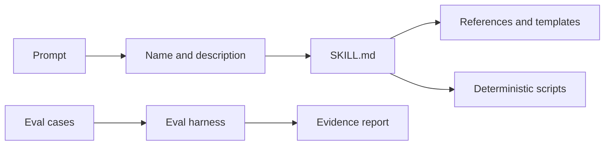

# Architecture

AIWorkbench is a portable catalog. Each `skills/<name>/SKILL.md` is a discovery and instruction entrypoint. Domain resources load on demand. Deterministic scripts validate structure; behavioral evals remain separate.

